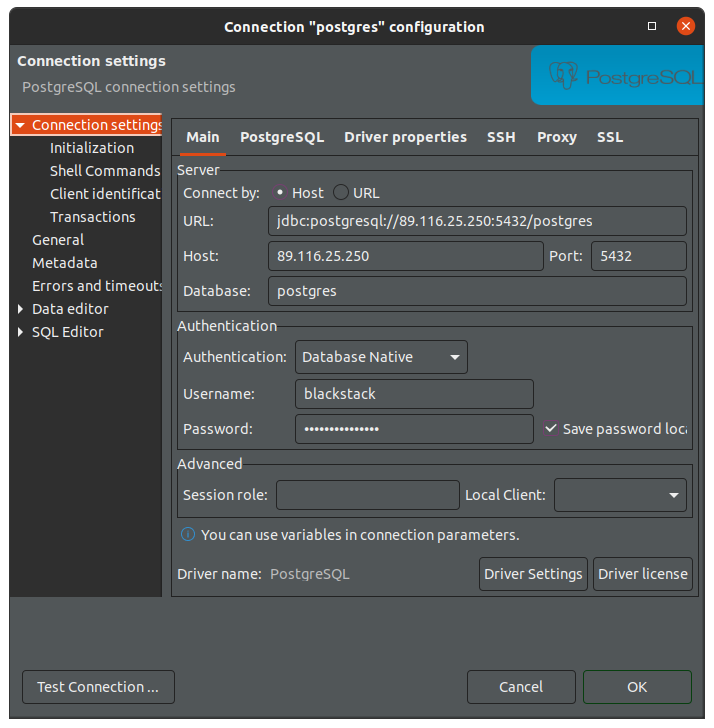
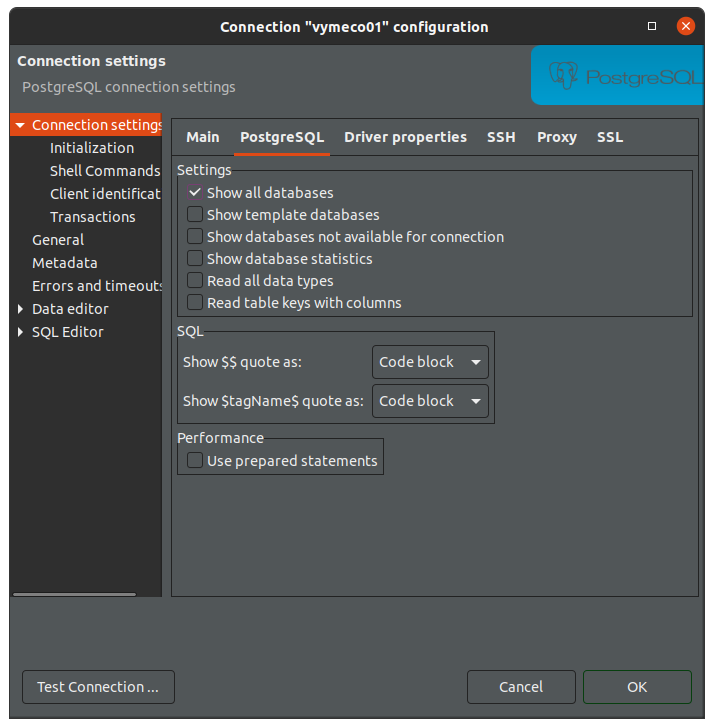

# Environment

Scripts for installing the environment for any of my projects on different Linux distros and version.

**Outline:**

1. [Getting Started](#1-getting-started)
2. [SSH Configuration](#2-ssh-configuration)
3. [Installation Scripts](#3-installation-scripts)
4. [PostgreSQL](#4-postgresql) 
    - [Database Instance](#41-database-instance)
    - [Database Password](#42-database-password)
    - [Edit postgresql.conf](#43-edit-postgresqlconf)
    - [Edit pg_hba.conf](#44-edit-pg_hbaconf)
    - [Restart PostgreSQL](#45-restart-postgresql)
    - [Try Connection](#46-try-connection)
    - [Install Required Extensions](#47-install-required-extensions)
5. [Docker Images](#5-docker-images)

## 1. Getting Started

Before running any installation script, you should create a `blackstack` user from where you will start any software process.

1. Create a new user `blackstack`:

```bash
sudo adduser blackstack
```

2. Add `blackstack` to `sudoers`:

```bash
sudo usermod -aG sudo blackstack
```

3. Switch to the new `blackstack` user:

```bash
sudo su - blackstack
```

Additonally, you may want to change the `hostname` of a new server (e.g.: `n01`):

```bash
sudo hostname n01
```

## 2. SSH Configuration

Additionally, be sure you will be able to connect via SSH using the `blackstack` user.

1. Edit the `sshd_config` file.

```bash
sudo nano /etc/ssh/sshd_config
```

2. Allow password authentication.

```bash
PasswordAuthentication yes
``` 

3. Restart the SSH service.

```bash
sudo service ssh restart
```

## 3. Installation Scripts

Anyone of the installation scripts listed below should run from the `blackstack` user created in the [Getting Started](#getting-started) section.

**IMPORTANT:** When the script has been done, log out SSH and access again to run the `profile.d` and get Ruby working.

**Ubunto 20.04:**

```bash
wget https://raw.githubusercontent.com/leandrosardi/environment/main/sh/install.ubuntu.20_04.sh -O - | bash
```

## 4. PostgreSQL

Install and running a PostgreSQL database sevice.

### 4.1. Database Instance

In the same `bash` terminal, create a new Postgres user with superuser rights.

```bash
sudo -u postgres createuser --interactive
```

The output is like this.

```bash
Enter name of role to add: blackstack
Shall the new role be a superuser? (y/n) y
```

### 4.2. Database Password

In the same `bash` terminal, access the **postgres** terminal.

```bash
sudo -u postgres psql
```

And then run this **postgres** command to assign a new password to the **blackstack** user.

```psql
\password blackstack
```

### 4.3. Edit `postgresql.conf`

```bash
cd /etc/postgresql/12/main/
```

Open file named `postgresql.conf`,

```bash
sudo nano postgresql.conf
```

and add this line to that file

```
listen_addresses = '*'
```

Also, increase the number of max allowed connections:

```
max_connections = 250
```

### 4.4. Edit `pg_hba.conf`

Then open file named `pg_hba.conf`,

```bash
sudo nano pg_hba.conf
```

and add this line to that file:

```
host  all  all 0.0.0.0/0 md5
```

It allows access to all databases for all users with an encrypted password.

### 4.5. Restart PostgreSQL

Finally, restart your server

```
sudo /etc/init.d/postgresql restart
```

### 4.6. Try Connection

Remember, connect to the `postgres` database in your new server.



If you are going to create other databases, remeber to activate the **Show all databases** checkbox in DBeaver.



### 4.7. Install Required Extensions

```sql
CREATE EXTENSION IF NOT EXISTS "uuid-ossp";
```


## 5. Docker Images

_(pending)_
